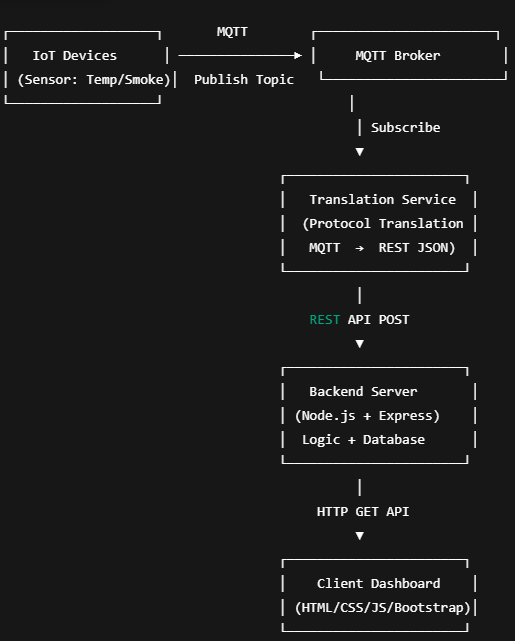
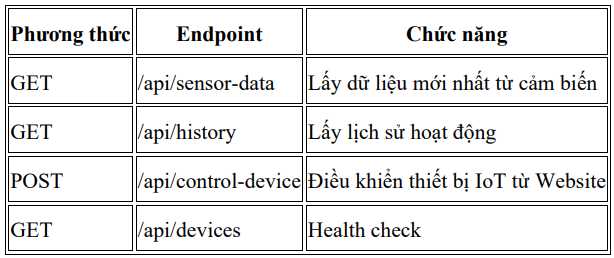
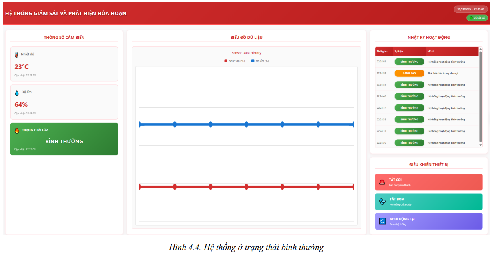
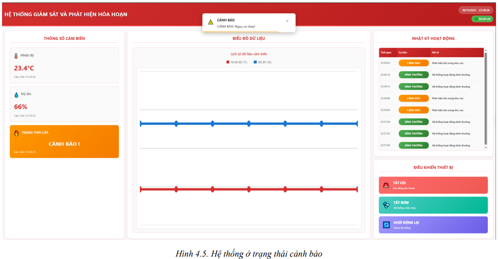
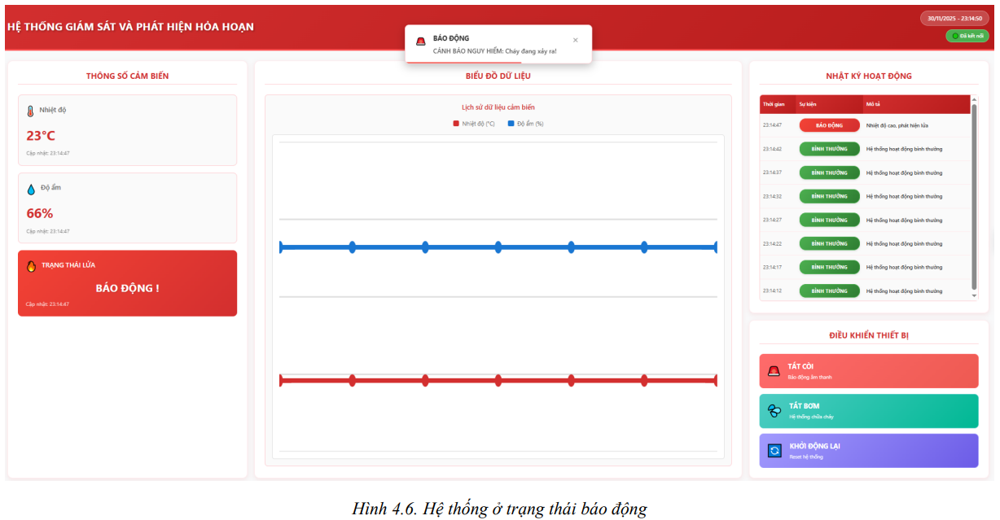

# BÀI TẬP LỚN: PHÁT TRIỂN PHẦN MỀM HƯỚNG DỊCH VỤ

## HỆ THỐNG GIÁM SÁT VÀ PHÁT HIỆN HOẢ HOẠN - FireDetectionSystem

---

## 🧑‍💻 THÔNG TIN NHÓM

| STT | Họ và Tên     | MSSV       | Email                          | Đóng góp    |
|-----|---------------|------------|--------------------------------|-------------|
| 1 | Doãn Mạnh Đạt | B20DCCN170 | DatDM.B20CN170@stu.ptit.edu.vn | Nhóm trưởng |

**Tên nhóm:** Nhóm 99 – SOA  
**Chủ đề đã đăng ký:** - API Pattern_Protocol Translation_FireDetectionSystem

---

## 🧠 MÔ TẢ HỆ THỐNG

### Tổng quan
> Hệ thống website giám sát, phát hiện hoả hoạn theo thông tin môi trường thực - sử dụng cảm biến DHT11, FlameSensor,...

### Khái quát
> Hệ thống bao gồm tầng thiết bị IoT thu thập thông tin môi trường theo thời gian thực và gửi tới **server** để chuẩn hoá dữ liệu và xử lý yêu cầu.
> Sau đó, **client** gửi yêu cầu đến server qua giao thức HTTP để lấy thông tin từ cảm biến và hiển thị lên Website hệ thống.
> Người dùng có thể thao tác thủ công tắt còi cảnh báo, tắt máy bơm nước và reboot hệ thống.


### Tính năng
>- Thu thập dữ liệu từ thiết bị IoT qua MQTT
>- Giám sát nhiệt độ và mức khói theo thời gian thực
>- Phát hiện và phân loại trạng thái cháy (NORMAL / WARNING / DANGER)
>- Chuyển đổi giao thức (Translation Protocol): MQTT → REST API
>- Lưu trữ sự kiện cháy vào Backend Server
>- Dashboard hiển thị trạng thái theo thời gian thực
>- Xem lịch sử các sự kiện cháy
>- 
### Cấu trúc logic tổng quát:
> IoT Devices <--> MQTT Broker <--> Translation Service <--> Backend REST API <--> Client Dashboard

### Sơ đồ hệ thống:



---

## ⚙️ CÔNG NGHỆ SỬ DỤNG


| Thành phần        | Công nghệ                                     | Ghi chú                                  |
|-------------------|-----------------------------------------------|------------------------------------------|
| IoT Devices       | ESP8266 + cảm biến nhiệt DHT11 + cảm biến lửa | Đo nhiệt độ & khói, gửi MQTT             |
| Translation Layer | Node.js                                       | Translation Protocol: chuyển MQTT → REST |
| Backend Server    | Node.js + Express.js                          | REST API, xử lý backend                  |
| Frontend Client   | HTML, CSS, JavaScript, Bootstrap              | Dashboard hiển thị dữ liệu               |
| Database          | SQLite                                        | Lưu trữ dữ liệu                          |

---

## 🚀 HƯỚNG DẪN CHẠY DỰ ÁN

### 1. Clone repository
```bash 

git clone https://github.com/doanmahndatt/SOA-PTIT_API-Pattern_Fire-Detection-System.git
cd fire-detection-system
```

### 2. Chạy server
```bash

>> open terminal for BE
cd backend
npm run dev
```

### 3. Chạy client
```bash

>> open terminal for FE
cd frontend
npm start
```

---

## 🔗 GIAO TIẾP (GIAO THỨC SỬ DỤNG)


## 📊 KẾT QUẢ THỰC NGHIỆM





---

## 🧩 CẤU TRÚC DỰ ÁN
```
fire-detection-system/
├── backend/                        # Server backend (REST API + Translation Protocol)
│   ├── node_modules/
│   ├── src/
│   │   ├── controllers/            # Controllers xử lý request REST
│   │   │   └── data.controller.js
│   │   ├── services/               # Business logic của Backend
│   │   │   └── fire-detection.service.js
│   │   ├── translation/            # Translation Protocol (MQTT → REST JSON)
│   │   │   └── translation.service.js
│   │   └── fire_detection.db       # SQLite database
│   ├── package.json
│   ├── package-lock.json
│   └── server.js                   # File khởi động Backend Server
├── database/                       # Script khởi tạo database
│   └── init.sql
├── fireAlarm_Arduino/              # Mã nguồn thiết bị IoT (Arduino/ESP)
│   └── fireAlarm.ino
├── frontend/                       # Giao diện người dùng (Dashboard)
│   ├── node_modules/
│   ├── public/                     # Assets tĩnh
│   │   └── index.html               
│   └── src/
│       ├── components/             # Component UI
│       │   ├── Notification.css
│       │   └── Notification.js
│       ├── config/                 # Cấu hình alert
│       │   ├── alerts.js
│       ├── App.css
│       ├── App.js
│       └── index.js
├── statics/                        # Hình ảnh, diagram phục vụ tài liệu
├── FinalProject-docx/              # File báo cáo
├── .gitignore
├── package.json                    # Root package (nếu dùng workspace)
└── README.md                       # Tài liệu mô tả dự án

```

---
## 🧩 HƯỚNG PHÁT TRIỂN THÊM

> Nêu ý tưởng mở rộng hoặc cải tiến hệ thống.

- [ ] Cải thiện giao diện người dùng
- [ ] Thêm tính năng xác thực và phân quyền
- [ ] Tối ưu hóa hiệu suất
- [ ] Triển khai trên cloud
- [ ] Tích hợp cảnh báo đa kênh (SMS, Email, Telegram/Zalo)

---

